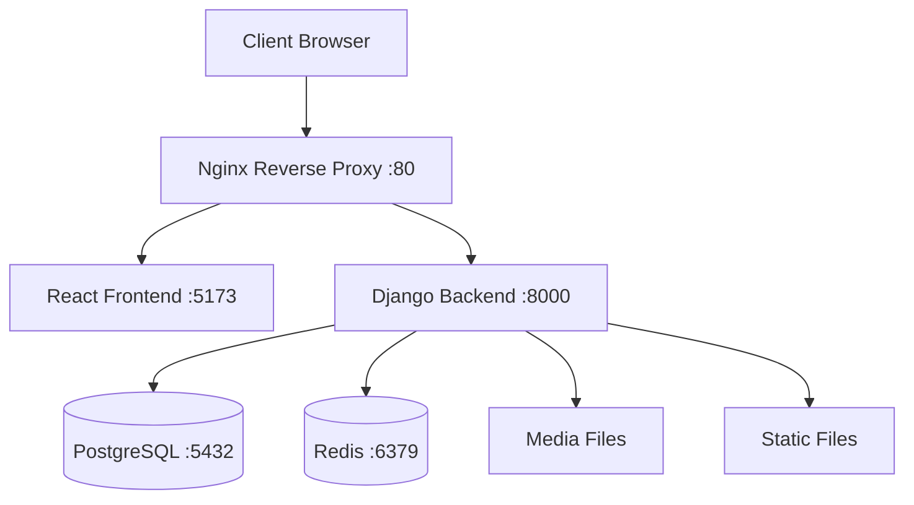

# 🐳 HireIQ Docker Compose Setup

This document provides comprehensive instructions for setting up and managing the HireIQ application using Docker Compose.

## 📋 Table of Contents

- [Overview](#overview)
- [Prerequisites](#prerequisites)
- [Quick Start](#quick-start)
- [Architecture](#architecture)
- [Environment Configuration](#environment-configuration)
- [Development Setup](#development-setup)
- [Production Setup](#production-setup)
- [Service Management](#service-management)
- [Troubleshooting](#troubleshooting)
- [Advanced Usage](#advanced-usage)

## 🔍 Overview

The HireIQ application uses a multi-service Docker Compose setup that includes:

- **Frontend**: React application with Vite (hot-reload in development)
- **Backend**: Django REST API with Gunicorn
- **Database**: PostgreSQL with persistent volumes
- **Cache**: Redis for caching and sessions
- **Proxy**: Nginx reverse proxy for routing
- **Future**: Celery workers for background tasks

## 📋 Prerequisites

- Docker Engine 20.10+
- Docker Compose 2.0+
- Git
- 4GB+ available RAM
- 10GB+ available disk space

### Installation Check

```bash
docker --version
docker-compose --version
```

## 🚀 Quick Start

### 1. Clone and Navigate

```bash
git clone <repository-url>
cd hire-iq
```

### 2. Environment Setup

```bash
# Copy environment template
cp env.example .env

# Edit environment variables
nano .env
```

### 3. Start Development Environment

```bash
# Using the helper script (recommended)
./docker-compose.sh dev up

# Or using docker-compose directly
docker-compose up -d
```

### 4. Access Services

- **Frontend**: http://localhost:8080
- **Backend API**: http://localhost:8080/api
- **Admin Panel**: http://localhost:8080/admin
- **Database**: localhost:5433
- **Redis**: localhost:6379

## 🏗️ Architecture



### Service Communication

- **Client** → **Nginx** (Port 80/443)
- **Nginx** → **Frontend** (Port 5173)
- **Nginx** → **Backend** (Port 8000)
- **Backend** → **Database** (Port 5432)
- **Backend** → **Redis** (Port 6379)

## ⚙️ Environment Configuration

### Development (.env)

```env
ENVIRONMENT=development
DEBUG=1
DATABASE_URL=postgresql://hireiq_dev_user:hireiq_dev_password@db:5432/hireiq_dev_db
REDIS_URL=redis://redis:6379/0
VITE_API_URL=http://localhost:8080/api
```

### Production

```env
ENVIRONMENT=production
DEBUG=0
DATABASE_URL=postgresql://hireiq_prod_user:secure_password@db:5432/hireiq_prod_db
REDIS_URL=redis://redis:6379/0
VITE_API_URL=/api
```

## 🛠️ Development Setup

### Start Development Environment

```bash
# Start all services
./docker-compose.sh dev up

# Build and start
./docker-compose.sh dev build
./docker-compose.sh dev up

# View logs
./docker-compose.sh dev logs
```

### Development Features

- **Hot Reload**: Frontend changes reflect immediately
- **Debug Mode**: Django debug mode enabled
- **Volume Mounts**: Code changes sync to containers
- **Separate Ports**: Avoid conflicts with other services

### Database Setup

```bash
# Run migrations
docker-compose exec backend python manage.py migrate

# Create superuser
docker-compose exec backend python manage.py createsuperuser

# Load fixtures (if any)
docker-compose exec backend python manage.py loaddata fixtures/initial_data.json
```

## 🚀 Production Setup

### Environment Preparation

1. **Create production environment file**:
   ```bash
   cp env.example .env.prod
   # Edit with production values
   ```

2. **Configure SSL certificates** (optional):
   ```bash
   mkdir -p ssl/certs ssl/private
   # Add your SSL certificates
   ```

### Deploy Production

```bash
# Build production images
./docker-compose.sh prod build

# Start production services
./docker-compose.sh prod up

# Check status
docker-compose ps
```

### Production Features

- **Optimized Builds**: Minified frontend, optimized backend
- **Security**: Non-root users, security headers
- **Performance**: Multi-worker Gunicorn, optimized Nginx
- **Persistence**: Named volumes for data persistence
- **Health Checks**: Automatic service health monitoring

## 🔧 Service Management

### Using Helper Script

```bash
# Development
./docker-compose.sh dev up        # Start services
./docker-compose.sh dev down      # Stop services
./docker-compose.sh dev build     # Build images
./docker-compose.sh dev logs      # View logs
./docker-compose.sh dev shell     # Open backend shell
./docker-compose.sh dev clean     # Clean everything

# Production
./docker-compose.sh prod up       # Start production
./docker-compose.sh prod build    # Build production
./docker-compose.sh prod logs     # View production logs
```

### Direct Docker Compose Commands

```bash
# Basic operations
docker-compose up -d              # Start in background
docker-compose down               # Stop services
docker-compose ps                 # List services
docker-compose logs -f            # Follow logs

# Service-specific operations
docker-compose logs backend       # Backend logs only
docker-compose exec backend bash  # Backend shell
docker-compose restart frontend   # Restart frontend
```

### Individual Service Management

```bash
# Scale services
docker-compose up -d --scale backend=2

# Restart specific service
docker-compose restart nginx

# View service logs
docker-compose logs -f backend frontend

# Execute commands in running containers
docker-compose exec backend python manage.py shell
docker-compose exec frontend npm run test
```

## 🔍 Troubleshooting

### Common Issues

#### 1. Port Conflicts

```bash
# Check what's using the port
sudo lsof -i :8080
sudo lsof -i :5432

# Kill conflicting processes
sudo kill -9 <PID>
```

#### 2. Permission Issues

```bash
# Fix file permissions
sudo chown -R $USER:$USER .
chmod +x docker-compose.sh
```

#### 3. Database Connection Issues

```bash
# Check database status
docker-compose exec db pg_isready -U hireiq_user

# Reset database
docker-compose down -v
docker-compose up -d db
docker-compose exec backend python manage.py migrate
```

#### 4. Redis Connection Issues

```bash
# Test Redis connection
docker-compose exec redis redis-cli ping

# Check Redis logs
docker-compose logs redis
```

#### 5. Build Issues

```bash
# Clean build (removes cache)
docker-compose build --no-cache

# Remove all containers and rebuild
docker-compose down
docker system prune -f
docker-compose up --build
```

### Health Check Commands

```bash
# Check all service health
docker-compose ps

# Manual health checks
curl -f http://localhost:8080/api/health/
curl -f http://localhost:8080/
docker-compose exec backend python manage.py check
docker-compose exec redis redis-cli ping
```

### Log Analysis

```bash
# All logs
docker-compose logs

# Specific service logs
docker-compose logs backend
docker-compose logs frontend
docker-compose logs nginx

# Follow logs in real-time
docker-compose logs -f --tail=100

# Filter logs by time
docker-compose logs --since="2024-01-01T00:00:00"
```

## 🔬 Advanced Usage

### Custom Networks

```bash
# Create external network
docker network create hireiq_external

# Use in docker-compose.yml
networks:
  default:
    external: true
    name: hireiq_external
```

### Volume Management

```bash
# List volumes
docker volume ls

# Inspect volume
docker volume inspect hire-iq_postgres_data

# Backup volume
docker run --rm -v hire-iq_postgres_data:/data -v $(pwd):/backup alpine tar czf /backup/postgres_backup.tar.gz -C /data .

# Restore volume
docker run --rm -v hire-iq_postgres_data:/data -v $(pwd):/backup alpine tar xzf /backup/postgres_backup.tar.gz -C /data
```

### Performance Monitoring

```bash
# Container stats
docker stats

# Resource usage
docker-compose top

# System usage
docker system df
```

### Security Scanning

```bash
# Scan images for vulnerabilities
docker scout cves <image-name>

# Security best practices check
docker-compose config --quiet
```

## 📝 File Structure

```
hire-iq/
├── docker-compose.yml              # Main compose file
├── docker-compose.override.yml     # Development overrides
├── docker-compose.sh               # Management script
├── env.example                     # Environment template
├── DOCKER_README.md                # This file
├── infrastructure/docker/
│   ├── docker-compose.dev.yml      # Development config
│   ├── docker-compose.prod.yml     # Production config
│   ├── Dockerfile.backend          # Backend Dockerfile
│   └── nginx.conf                  # Nginx configuration
├── frontend/
│   └── Dockerfile                  # Frontend Dockerfile
└── backend/
    └── requirements.txt            # Python dependencies
```

## 🤝 Contributing

When making changes to Docker configuration:

1. Test in development environment first
2. Update documentation if needed
3. Test both development and production builds
4. Ensure health checks pass
5. Update version numbers if applicable

## 📞 Support

For Docker-related issues:

1. Check this documentation
2. Review logs: `./docker-compose.sh dev logs`
3. Check service health: `docker-compose ps`
4. Create an issue with:
   - Docker version
   - Error logs
   - Steps to reproduce

---

**Happy Dockerizing! 🐳** 